# V13 실내 융합 파이프라인 — 최종 프로젝트 명세서

> **전체 코드 명세 색인**: [`SPEC_INDEX.md`](SPEC_INDEX.md) — V1~V14·분석 스크립트의 **진화 흐름·수식·분석 결과 해석**은 [`SPEC_v12_v13_family.md`](SPEC_v12_v13_family.md), [`SPEC_evolution_v01_v07.md`](SPEC_evolution_v01_v07.md), [`SPEC_evolution_v08_v11.md`](SPEC_evolution_v08_v11.md), [`SPEC_analysis_and_JWT.md`](SPEC_analysis_and_JWT.md) 등을 참고합니다.  
> **후속 무결 확장 안**: Train-OOF 게이트·composite Optuna — [`V15_PIPELINE_SPEC.md`](V15_PIPELINE_SPEC.md) (**팀 권장 최종안은 여전히 본 V13 문서 기준**).

본 문서는 팀 워크스페이스용 **최종 선정 코드**인 `scripts/indoor_fusion_pipeline_v13.py`의 역할, 설계 원칙, 실행 방법, 산출물을 정리한 것입니다.

---

## 1. 최종 선정 사유

동일 학습·검증 데이터(`data/train`, `data/validation`)와 무결성 규약 하에서 **V12 Turbo·V14(JWT)**와 비교했을 때, 검증 세트에서 **Step A/B/C RMSE 모두 최저**였습니다.

| 지표 | V13 (최종) | 참고 (V12 Turbo) |
|------|------------|-------------------|
| 검증 Step A RMSE (m) | **1.462** | 1.510 |
| 검증 Step B RMSE (m) | **1.419** | 1.445 |
| 검증 Step C RMSE (m) | **1.425** | 1.452 |

수치 출처: `outputs/v13_summary.json` 및 동일 조건 재현 런.

**V12 Turbo 상세**(설계 목적·Phase A의 실제 동작 — 가이드 XY는 V3 동급 고정 등·Numba Step B/C·환경변수·산출물): **[`V12_TURBO_PIPELINE_SPEC.md`](V12_TURBO_PIPELINE_SPEC.md)** 를 참고합니다.

**트레이드오프**: V13은 폴드당 보정 학습·캐시 구축·탐색 차원 증가로 **V12 Turbo 대비 실행 시간이 길 수 있음**(예: 동일 환경에서 대략 수십 초 vs 1분 초반대).

---

## 2. 한 줄 요약

**Fast2 스타일 Step A**(보정 Wi‑Fi 삼변과 V3 동급 삼변의 컨벡스 블렌드, 선택적 KNN 잔차)와 **V12 Turbo의 Numba Step B/C**를 묶고, **Optuna**가 Train K‑Fold **Step C 평균 RMSE**만 최소화하도록 하이퍼파라미터를 선택한다. 검증 라벨(`True_X/Y`)은 **최종 1회 보고**에만 사용한다.

---

## 3. 실행 방법

프로젝트 루트에서:

```powershell
py -3 .\scripts\indoor_fusion_pipeline_v13.py
```

플롯(PNG) 생략:

```powershell
py -3 .\scripts\indoor_fusion_pipeline_v13.py --no-plots
```

**필수 패키지**: `pandas`, `numpy`, `matplotlib`, `scikit-learn`, `numba`, `optuna`  
내부 모듈: `fusion_realtime_sanitize`, `indoor_fusion_pipeline_v8`~`v12`, **`indoor_fusion_pipeline_v12_turbo`**(Numba 배치 추론 재사용).

---

## 4. 처리 흐름 (개요)

```mermaid
flowchart LR
  subgraph data [입력]
    Tm[Train median/variance]
    Vm[Validation median/variance]
  end
  subgraph prep [전처리]
    Load[FusionLocalizerV8 로드]
    Imp[Wi‑Fi median 보간]
  end
  subgraph phaseA_rank [Phase A 순위화]
    Cat[확장 캘리브 카탈로그]
    CV1[폴드별 순수 보정 Step A CV RMSE]
    Merge[운용점 우선 병합 + CV 순 채우기]
  end
  subgraph cache [Train 캐시]
    Fold[KFold 폴드]
    PerRank[캘리브 랭크별 coeff·Step A XY]
    V3prof[V3 프로필별 Step A XY 스택]
  end
  subgraph opt [Optuna]
    Obj["목적: 폴드 평균 Step C RMSE"]
  end
  subgraph final [최종]
    Fit[전체 Train 재피팅]
    ValFwd[검증 단일 포워드 A→B→C]
    Out[outputs/v13_*]
  end
  data --> Load --> Imp
  Imp --> Cat --> CV1 --> Merge
  Merge --> Fold --> PerRank
  Fold --> V3prof
  PerRank --> Obj
  V3prof --> Obj
  Obj --> Fit --> ValFwd --> Out
```



---

## 5. 단계별 정의

### Step A (가이드 위치)

- **보정 분기**: 폴드(또는 최종 전체 학습)마다 AP별 강건 보정 계수 학습 후 `predict_step_a_calibrated`로 XY.
- **V3 동급 분기**: 미리 정의된 `V3_PROFILES`(Huber 스케일, RSS bias 페어)로 `predict_step_a_v3_wifi_equivalent`.
- **블렌드**: `(1−α)·V3_XY + α·보정_XY` 형태의 **컨벡스 결합**(`convex_blend_xy_njit`; 비유효 좌표는 한쪽만 있으면 그쪽 채택).
- **KNN 잔차**(선택): Train에서 추정 XY 대 True 잔차를 거리 역가중 KNN으로 학습해 검증(및 폴드 내 테스트) XY에 더함. 환경 변수로 허용 시에만 실효 가능(아래 §7 참고).

### Step B / Step C

- `indoor_fusion_pipeline_v12_turbo`의 **`batch_step_b_preds_flat`**, **`batch_step_c_preds_flat`** 재사용.
- **Tukey 상수**, **삼변 Gauss‑Newton 반복 수** 등은 Turbo와 동일하게 **고정**(과도한 DOF로 검증 일반화가 무너지는 것을 줄이기 위함).

---

## 6. 데이터 무결성 (중요)

| 항목 | 내용 |
|------|------|
| Optuna 목적값 | **Train K‑Fold 평균 Step C RMSE**만 사용 |
| 검증 정답 | 하이퍼 선택·목적값에 **비개입**. 전체 학습 후 **단일 검증 평가**에만 사용 |
| Wi‑Fi 보정 학습 | KFold 시 **항상 해당 학습 폴드만**으로 `fit_robust_calibration_per_ap`; 테스트 폴드는 해당 계수만 적용 |

---

## 7. 환경 변수

| 변수 | 기본값 | 의미 |
|------|--------|------|
| `V13_MAX_KFOLD` | `3` | KFold 상한과 결합되어 실제 폴드 수 결정 |
| `V13_OPTUNA_TRIALS` | `42` | Optuna 시행 횟수 |
| `V13_OPTUNA_JOBS` | `V12_TURBO_OPTUNA_JOBS` 또는 `-1` | 병렬 워커 수. Windows에서 피클 부담 시 `4` 등 권장 |
| `V13_OPTUNA_SEED` | `42` | TPE 등 재현 시드 |
| `V13_PLOT_DPI` | `110` | PNG 해상도 |
| `V13_TOP_CALIB_RANKS` | `0` | **0이면 카탈로그 전 길이**까지 캐시; 양수면 상한 적용 |
| `V13_ALLOW_KNN` | (미설정) | `1`/`true`/`yes` 시에만 블렌드가 순수(0 또는 1이 아닐 때) **KNN 잔차 후보 활성**. 기본은 **미사용(0)**

---

## 8. CLI

| 플래그 | 효과 |
|--------|------|
| `--no-plots` | `v13_map_true_vs_predicted_steps.png`, `v13_cdf_steps.png` 저장 생략 |

---

## 9. Optuna 탐색 공간 (코드 기준 요약)

- `calibration_rank`: 병합된 캘리브 랭크 인덱스 `0 … n−1`
- `v3_profile_idx`: `V3_PROFILES` 인덱스
- `blend_calib_alpha`: `{0.0, 0.2, 0.35, 0.5, 0.65, 0.8, 1.0}`
- `knn_residual_neighbors`: `{0, 3, 6}` (허용·블렌드 조건 불만족 시 0으로 강제)
- `gate_threshold_m`: `1.25`–`2.05` (연속)
- `uwb_variance_inflate`: `8.0`–`24.0` (연속)
- `huber_f_fusion`: `{1.0, 1.2, 1.35}`
- `irls_residual_thresh_m`: `{2.2, 2.75, 3.05, 3.1}`

폴드 목적값 계산에는 **항상 Step C 배치 함수**만 사용(Step B만으로 순위 매기지 않음).

---

## 10. 캘리브레이션 캐시 병합

`calibration_catalog_extended()`로 후보 목록을 만든 뒤, `rank_calibration_candidates`로 순수 보정 Step A CV 점수를 산출한다.

그다음 **`merge_calib_ranks_operating_points_then_cv`**에서:

1. Turbo/v12 계열 운용점(예: identity+hf1, identity+hf1.35, Huber 특정 페어)을 **앞쪽에 고정 삽입**
2. 나머지 자리를 **순수 보정 Step A CV 순**으로 채움

이렇게 해서 Turbo 우승축이 빠져 캐시에서 제외되는 문제를 줄인다.

---

## 11. 산출물 (`outputs/`)

스크립트가 **직접** 쓰는 파일 접두사는 **`v13_`** 입니다.

| 파일 | 내용 |
|------|------|
| `v13_summary.json` | 파이프라인 메타, 무결성 문구, 선택 하이퍼파라미터, Train CV best, 검증 RMSE/MAE, 데이터 경로 |
| `v13_predictions.csv` | 검증 각 행: 노드·True XY, Step A/B/C 예측, 오차 |
| `v13_grid_phaseA_calib_catalog.csv` | 캘리브 후보별 순수 보정 Step A CV 메타 |
| `v13_optuna_trials.csv` | 완료 Trial 파라미터·목적값 |
| `v13_wifi_calibration_coefs.csv` | 최종 전체 학습 기준 Wi‑Fi 보정 계수(AP별 A,B) |

**플롯**(기본): `v13_map_true_vs_predicted_steps.png`, `v13_cdf_steps.png`

> 참고: 워크스페이스에 `v13_grid_phaseA.csv` 등 **스크립트에 없는 파일명**이 있을 수 있습니다. 과거 다른 실험이거나 수동 저장분일 수 있어, 최종 파이프라인 기준은 위 표를 따른다.

---

## 12. 재현 참고용 — 최근 검증 우수 런의 선택값

아래는 `outputs/v13_summary.json`에 기록된 **한 번의 성공 런** 예시입니다(데이터 변경 시 달라질 수 있음).

- **Wi‑Fi 보정**: identity, `feat_mode=bias_sub`, 보정 분기 Huber 스케일 `huber_f_wifi_calibrated_trilat=1.35`
- **V3 프로필**: index 0 → `huber_f_scale=1.35`, `wifi_bias_m=2.5`
- **블렌드**: `blend_calib_alpha=0.5`
- **KNN**: 허용 off → `effective_knn_for_forward=0`
- **융합/게이트**: `gate_m≈1.456`, `uwb_variance_inflate≈12.30`, `huber_f_fusion=1.2`, `irls_residual_thresh_m=3.1`, `irls_max_iter=2`
- **고정 상수**: `trilat_gn_iterations_fixed=22`, `irls_tukey_c_fixed=4.685`

---

## 13. 알려진 이슈 및 운영 팁

- **Windows + Optuna 병렬**: 워커가 큰 객체를 피클할 수 있음. 부하가 크면 `V13_OPTUNA_JOBS=4` 또는 `8` 설정.
- **과적합**: 주석 및 설계 의도대로 Train CV만 맞추면 Step A 블렌드·게이트 조합 검증에 불리할 수 있음 → 본 프로젝트에서는 **실제 검증 수치로 V13 선택**했음을 문서화해 둠.
- **V14와의 차이**: V14는 Wi‑Fi에 JWT류 가중·Isotonic 등이 추가된다. 현재 데이터에서는 검증에서 V13보다 불리했고, V13은 **Turbo 계열 융합**을 공유하면서 Step A만 강화한 구조.

---

## 14. 문서·코드 변경 시

명세 수정은 다음을 함께 갱신하는 것을 권장한다.

1. 본 파일 `docs/V13_FINAL_PIPELINE_SPEC.md`
2. `scripts/indoor_fusion_pipeline_v13.py` 상단 모듈 docstring(의도 요약과 동기화)

---

*작성 기준: `indoor_fusion_pipeline_v13.py` 소스 및 `outputs/v13_summary.json`.*
