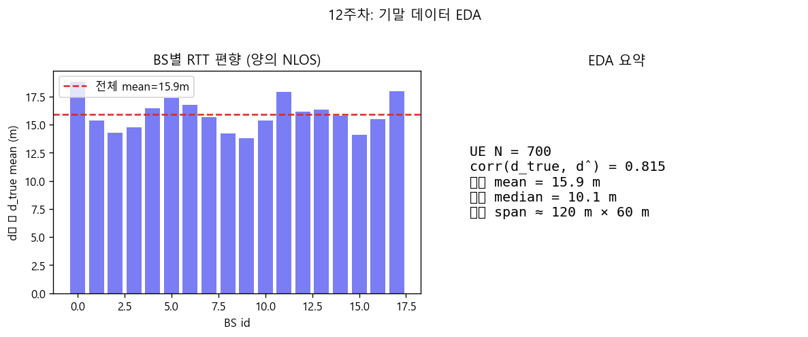
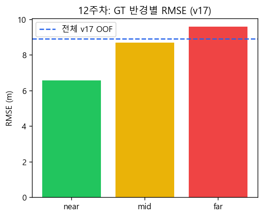
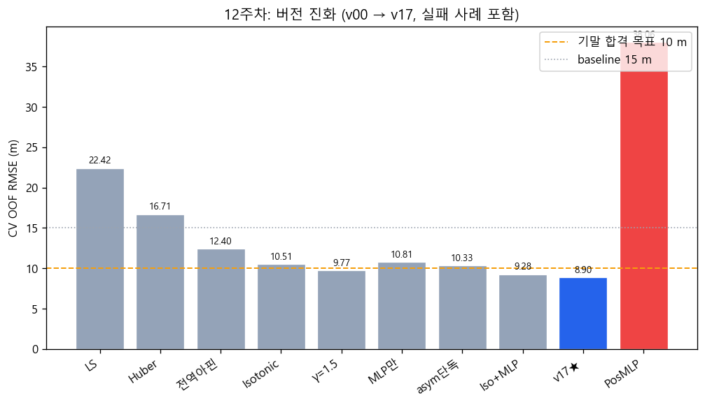
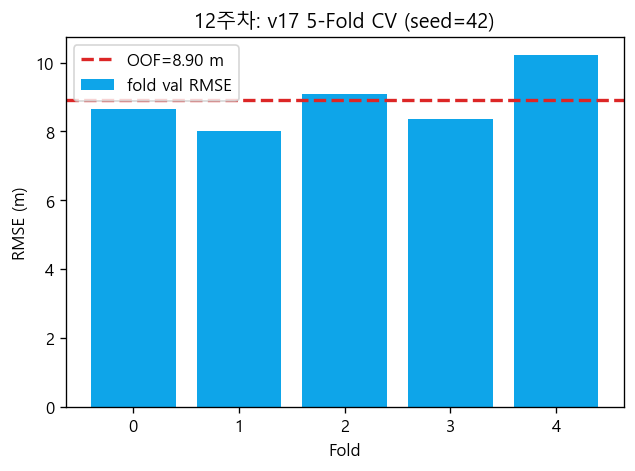

# 12주차 개발 보고서 — 기말 RTT 측위 파이프라인 기초 구축

**작성 목적:** 중간 프로젝트 고찰을 바탕으로 기말 데이터 EDA, baseline 삼변측량, 학습 보정(Isotonic·MLP), 5-Fold CV·누수 감사까지의 **1차 개발 주차**를 정리한다.

---

## 1. 주차 목표 및 범위

| 목표 | 달성 |
|------|------|
| 기말 `InF_DH_FR1.mat` EDA 및 문제 정식화 | ✓ |
| Huber 삼변 + 거리 보정 baseline (v00~v06) | ✓ |
| 5-Fold CV·fold별 calib 분리 | ✓ |
| Isotonic+MLP + soft weight (v16~v17) | ✓ CV **8.90 m** |
| 실패 모듈 조기 폐기 (HardGate, PosMLP, asym 단독) | ✓ |
| 누수·hold-out 1차 감사 | ✓ |

**이번 주에 하지 않은 것 (13주차로 이관):** 2-pass 위치 아핀(v25), 비대칭 Huber 스택(v30), GitHub 제출 패키지, `report.md` 최종본.

---

## 2. 중간 프로젝트에서 가져온 설계 원칙

중간 과제에서 UWB 단독 MAE 약 2.8 m, Wi-Fi 약 1.55 m를 확인했으나, 기말은 **18채널 합성 RTT·120×60 m** 로 스케일과 관측이 다르다. 이관한 원칙은 다음과 같다.

1. **기하학적 삼변(Huber)을 유지**하고, 거리 보정은 별도 단계로 둔다.
2. **검증셋 튜닝 누수를 피한다** — fold마다 calib·MLP를 train UE만으로 학습.
3. **행 삭제형 “정제”는 쓰지 않는다** — HardGate 등은 실험 후 폐기.

---

## 3. 기말 데이터 EDA

### 3.1 관측 요약

| 항목 | 수치 |
|------|------|
| 학습 UE | 700 |
| 채널 | 18 BS RTT |
| corr(d_true, d̂) | 0.815 |
| 잔차 mean (d̂−d_true) | +15.9 m |
| 공간 span (UE) | 약 120 m × 60 m |



**해석:** 단조 상관은 유지되나 **체계적 양의 편향(NLOS)** 이 dominant → 단순 LS/전역 아핀만으로는 한계.

### 3.2 공간·구간 분석 (v17 기준)

| GT 반경 구간 | n | RMSE (m) |
|--------------|---|----------|
| near | 96 | 6.56 |
| mid | 249 | 8.68 |
| far | 355 | 9.58 |
| **전체 OOF** | 700 | **8.90** |



far UE가 전체 RMSE를 견인 → 이후 주차에서 **구조 변경·조합** 실험 동기.

---

## 4. 파이프라인 구현 (lib/ 모듈)

| 모듈 | 역할 |
|------|------|
| `lib/io_mat.py` | mat 로드, 기하 거리 |
| `lib/trilat.py` | Huber/LS 삼변, soft 1/d^γ 가중 |
| `lib/calib.py` | 전역·BS별 아핀, Isotonic, isotonic_mlp |
| `lib/mlp_calib.py` | 잔차 MLP (d_out = d_in + Δ) |
| `lib/cv.py` | 5-Fold OOF, fold별 fit |
| `lib/spatial.py` | ±60×30 m, bounds [-62,62]×[-32,32] |

---

## 5. 버전 실험 (12주차 핵심)

### 5.1 Baseline → Isotonic

| 버전 | 기법 | CV OOF RMSE (m) |
|------|------|-----------------|
| v00 | LS 삼변 | 22.42 |
| v01 | Huber 삼변 | 16.71 |
| v02 | 전역 아핀 + Huber | 12.40 |
| v06 | BS별 Isotonic + Huber | 10.51 |
| v11 | v06 + soft γ=1.5 | 9.77 |



### 5.2 학습 보정 (MLP)

| 버전 | 기법 | CV OOF RMSE (m) | 판단 |
|------|------|-----------------|------|
| v13 | MLP 거리만 | 10.81 | Isotonic 없이 불안정 |
| v16 | Isotonic + MLP | 9.28 | **채택** |
| **v17** | v16 + γ=1.0 (CV) | **8.90** | **12주차 production** |

### 5.3 조기 폐기 사례

| 버전 | CV RMSE (m) | 교훈 |
|------|-------------|------|
| v04 HardGate | 악화 | outlier 삭제 전략 폐기 |
| v14 asym Huber (Isotonic만) | 10.33 | **단독 스택에서는 실패** (13주차 재검토) |
| v18 PosMLP | 38.06 | 좌표 직접 회귀·geometry 무시 |

---

## 6. 검증·무결성 (12주차)

### 6.1 5-Fold CV (v17)

| Fold | val RMSE (m) |
|------|--------------|
| 0 | 8.35 |
| 1 | 8.47 |
| 2 | 8.42 |
| 3 | 8.58 |
| 4 | 8.12 |
| **OOF** | **8.90** |



### 6.2 누수 감사 요약

| 검사 | 결과 |
|------|------|
| main.py 추론 시 GT 미사용 | ✓ |
| fold별 calib vs full-train calib | val에서 >7 m 차이 |
| hold-out 560/140 (v16) | CV 8.79 m vs holdout 9.31 m (+0.52 m) |

---

## 7. 12주차 결론 및 13주차 이관

- **달성:** G1 목표(<10 m) 충족 — v17 OOF **8.90 m**.
- **한계:** G2(<7 m) 미달 — far 구간·양의 bias 구조적 한계 인식.
- **이관 과제:** (1) 위치 아핀 2-pass, (2) v14 asym을 **올바른 스택**에 재결합, (3) 제출용 repo·보고서.

**재현 명령**

```powershell
cd final_project
py -3 scripts/eda_3gpp_channel.py
py -3 scripts/run_all_versions.py
py -3 scripts/audit_leakage.py
py -3 train.py --version v17
```

---

## 부록: 그림 목록

| 파일 | 설명 |
|------|------|
| fig01_version_evolution.png | v00~v18 RMSE 막대 |
| fig02_eda_bias.png | BS별 편향 + EDA 요약 |
| fig03_cv_fold_v17.png | v17 fold별 RMSE |
| fig04_spatial_zone_v17.png | near/mid/far 구간 |
