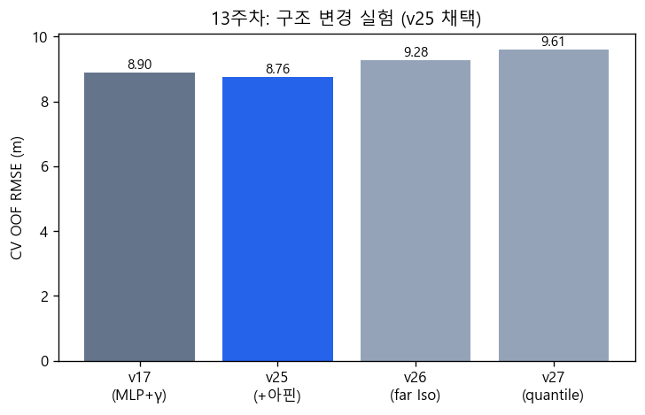
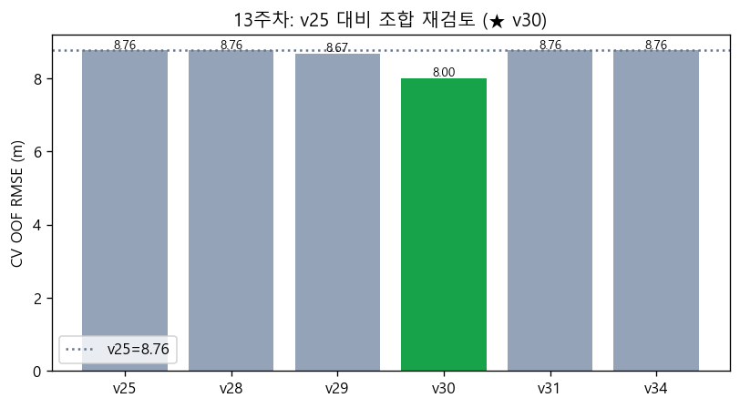
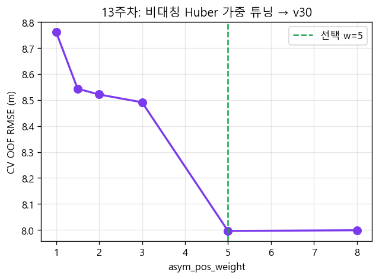
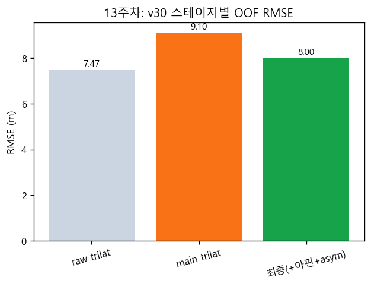
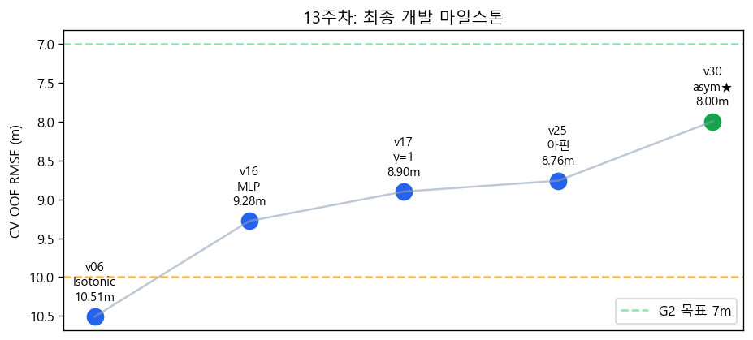

# 13주차 개발 보고서 — 구조 실험·v30 확정·제출

**작성 목적:** 12주차 v17 이후 **구조 변경(v25~v27)**, **ablation·조합 재검토**, **최종 v30 확정**, **GitHub 제출 패키지**까지의 개발 과정을 정리한다.

---

## 1. 주차 목표 및 범위

| 목표 | 달성 |
|------|------|
| v17 대비 구조 변경 (위치 아핀, far Iso, quantile) | ✓ v25 채택 |
| 단일 요인 ablation (v21~v24) | ✓ 대부분 무효 확인 |
| “단독만 실험했던” 항목 조합 재검토 | ✓ **v30 7.996 m** |
| `main.py`/`train.py` 단일 파일 제출 구조 | ✓ submit/ |
| `report.md` + Public GitHub | ✓ |

**선행:** [12주차 보고서](../12주차/12주차_보고서.md) (v17까지)

---

## 2. 구조 변경 3종 (v25~v27)

12주차 말미 RMSE **8.90 m** 근처에서 **위치 도메인 잔차**를 흡수할 구조를 검토했다.

| 버전 | 내용 | CV OOF RMSE (m) | 판단 |
|------|------|-----------------|------|
| v17 | Iso+MLP+γ=1.0 | 8.90 | 기준 |
| **v25** | 1차 삼변 후 **2-pass 위치 아핀** | **8.76** | **채택** |
| v26 | far UE 2차 Isotonic | 9.28 | ✗ |
| v27 | quantile(τ CV)+MLP | 9.61 | ✗ |



**교훈:** 거리 보정을 이중화(v26)하거나 quantile(v27)로 바꾸기보다, **기하 삼변 뒤 소규모 아핀**이 효과적.

---

## 3. 단일 요인 ablation (v17 대비)

| 버전 | 가설 | CV RMSE (m) | Δ vs v17 |
|------|------|-------------|----------|
| v17 | baseline | 8.90 | — |
| v21 | min(d̂) 3구간 Isotonic+MLP | 8.91 | +0.01 |
| v22 | quantile τ=0.35 + MLP | 9.61 | +0.71 |
| v23 | zone 가중 (near↑ far↓) | 8.90 | 0 |
| v24 | MLP 노이즈 σ=0.03 | 9.07 | +0.17 |

→ **한 모듈만 바꿔서는 7 m대 진입 불가** → 조합·스택 순서 재검토 필요.

---

## 4. 조합 재검토 (retrospective)

12주차에서 **단독 실험만 하고 v17/v25와 조합하지 않았던** 항목을 v25 baseline 위에서 재실험했다 (`outputs/combination_review.json`).

| 버전 | 조합 내용 | CV RMSE (m) | Δ vs v25 |
|------|-----------|-------------|----------|
| v25 | baseline (MLP+γ+아핀) | 8.76 | — |
| v28 | γ CV | 8.76 | 0 (best γ=1.0) |
| v29 | Huber f_scale CV | 8.67 | −0.09 |
| v31 | top_k (보정 후 k) | 8.76 | 0 |
| v34 | far 2차 아핀 | 8.76 | 0 |
| **v30** | **비대칭 Huber w=5** | **7.996** | **−0.77** |



### 4.1 핵심 통찰 (참신성)

- v14 **비대칭 Huber 단독** → 10.33 m (실패)
- **v25 스택 뒤에 asym w=5** → **7.996 m** (대폭 개선)

→ NLOS(+bias) 환경에서는 “예측 거리 > 관측”을 억제하는 penalty가 **거리 학습·아핀 이후 삼변**에만 맞는다.

### 4.2 asym 가중 그리드 (v30)

| w_pos | CV RMSE (m) |
|-------|-------------|
| 1.0 | 8.762 |
| 3.0 | 8.491 |
| **5.0** | **7.996** |
| 8.0 | 7.999 |



w=5에서만 점프, w=8은 이득 없음 → **w=5 확정**.

---

## 5. v30 최종 파이프라인

```
d̂ → BS별 Isotonic → MLP 잔차 → Huber 삼변(γ=1, asym_w=5) → 2-pass 위치 아핀 → clip
```

### 5.1 스테이지 OOF 분해

| 스테이지 | RMSE (m) |
|----------|----------|
| raw trilat (보정 전) | 7.47 |
| main trilat (보정 후, 아핀 전) | 9.10 |
| **최종 (v30)** | **7.996** |



거리 보정만으로는 위치 RMSE가 일시 악화되나, **아핀+비대칭**이 최종 수렴을 담당.

### 5.2 마일스톤



| 지표 | v30 |
|------|-----|
| OOF RMSE | 7.996 m |
| OOF median | 6.21 m |
| OOF p90 | 11.18 m |

---

## 6. 제출 패키징 (GitHub)

| 항목 | 내용 |
|------|------|
| Repo | SME-Experiment2-FinalProject-12223637 (Public) |
| 파일 | `main.py`, `train.py`, `report.md`, `model_mlp.pt` |
| 구조 | lib/ 통합 → main·train 단일 파일, 설정은 model_mlp.pt 번들 |
| 채점 | hidden 300 UE, `num_user` 동적, GT 미사용 |

**로컬 검증 (제출 전)**

| N users | 실행 시간 (대략) |
|---------|------------------|
| 300 | 2.4 s |
| 700 | 5.7 s |
| 1000 | 8.4 s |

10분 제한 대비 여유 충분.

---

## 7. 개발 산출물·스크립트

| 스크립트 | 용도 |
|----------|------|
| `run_structural_v25_v27.py` | v25~v27 |
| `run_ablation.py` | v21~v24 |
| `run_combination_review.py` | v28~v35, v30 |
| `train.py --version v30` | 최종 아티팩트 |
| `gen_week12_week13_figures.py` | 주차 보고서 그림 |

| JSON | 경로 |
|------|------|
| 조합 재검토 | `outputs/combination_review.json` |
| v30 요약 | `outputs/v30_summary.json` |
| 누수 감사 | `outputs/leakage_audit.json` |

---

## 8. 13주차 결론

- **최종 production:** v30 — CV OOF **7.996 m** (v17 대비 **−0.90 m**, v25 대비 **−0.77 m**).
- **가장 큰 기여:** 비대칭 Huber의 **스택 순서 발견** (단독 실패 → 조합 성공).
- **제출 완료:** 코드·보고서·model.pt Public repo.

**한계·향후:** far UE RMSE 여전히 높음; fold-nested asym 튜닝, min(d̂) zone+아핀 재조합은 optional.

---

## 부록: 그림 목록

| 파일 | 설명 |
|------|------|
| fig01_structural_v25_v27.png | v25~v27 비교 |
| fig02_combination_review.png | v25 대비 조합 |
| fig03_asym_grid_v30.png | w_pos 그리드 |
| fig04_stage_decomposition_v30.png | v30 스테이지 RMSE |
| fig05_milestone_timeline.png | v06→v30 마일스톤 |
